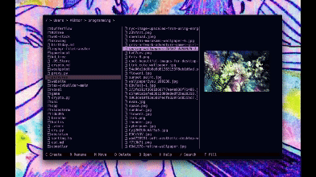

# tfinder - A minimal tui-based file manager written in Rust  



**Note! Majority of key features missing or likely not tested properly. Don't use for any actual stuff, for now this is just a toy-project I'm making for fun.**

## Installation

To test out tfinder simply clone the repo and build with Cargo:

```shell
git clone git@github.com:poorlajka/tfinder.git
cd tfinder
cargo build --release
```

And excecute the binary

```shell
cd release
./tfinder
```


## Usage


### Keybinds:

* up/down-arrow or jk to traverse the currently selected file pane
* left/right-arrow or hl to switch currently selected pane
* esc to quit

### Mouse

Try clicking on stuff UwU

## Configuration

tfinder currently looks for a settings file in it's project folder. This is stupid and should be changed.

### Colors

You can set the colors of these components to rgb values or names of default terminal colors like magenta or white.

```
[colors]

[colors.file_panes]
background = "black" 
border = "#c397d8" 
hover = "Magenta" 
selected_focus = "#c397d8" 
selected_no_focus = "#523c51" 
text_default = "#c397d8" 
text_selected = "#000000" 

[colors.path_trail]
background = "#000000" 
text_default = "#c397d8" 
text_hovered = "White" 

[colors.prompt_bar]
background = "#0a0000" 
text_default = "#c397d8" 
text_hovered = "#FFFFFF" 
text_prompt = "#FFFFFF" 
```

## TODO

* Fix picker on windows(does not compile atm)
* Carpet bomb event handler(it sucks) and bugfix/rewrite/refactor that shit
* Display ascii art for folders and filetypes
* Implement rest of commands
* Implement custom made commands
* Make images not be sooooo sloooooow if possible
* Rest of color config
* Look for config file in os based folder instead of project folder
* Vacuum rest of code for some silly stuff
* Make resizing work properly
* Figure out if scrolling can be nicer for stateful list or if it's better to make something myself
